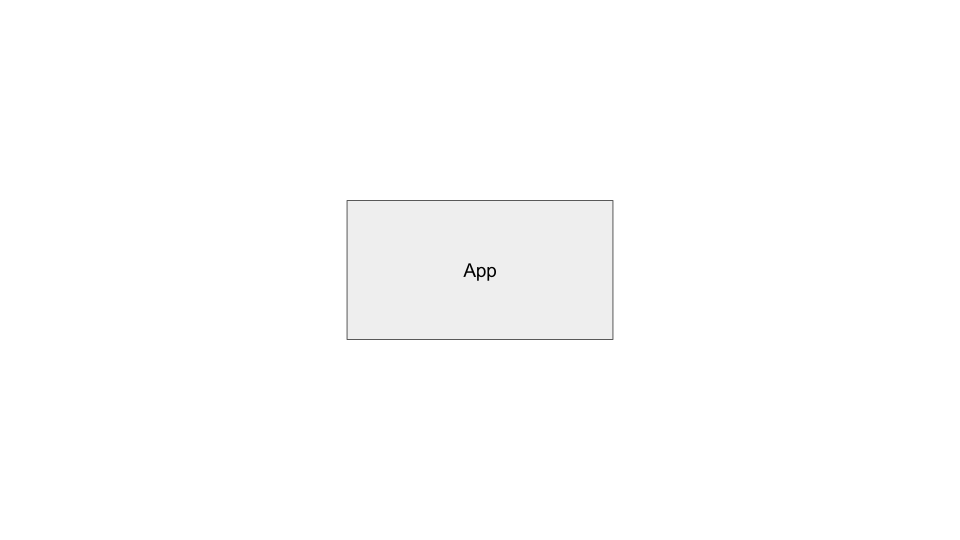

This content is copyright of CloudCredo. © CloudCredo 2015. All rights reserved.

----

## As a Cloud Native I can push an application into Cloud Foundry

----

----

## Cloud Foundry

* A platform for running your code
* Handles servers and networking so you don't have to
* And much more

Note:
platform for running applications

It takes care of heavy lifting

Think about deploying an app without a platform 

Provision server, networking, load balancing, security

In this talk we'll show you how to use it

Hands on

What is a 'Cloud Native' app?

----

## 12 Factor Apps
(cloud native architecture)

http://12factor.net

Note:
Heroku

Best practices

Lots of info on the website

We'll discuss the basics

Throughout workshop we'll demonstrate some of the principles

----

## Stateless Processes
Note:
Don't let any app you run in the cloud be special

Don't hang on to special data

In memory or local filesystem

Apps in the cloud need to be free to come and go

be prepared to be terminated by the platform

be prepared to scale up and down

----

## Inject Everything
Note:
Don't bake any config into your apps

things are likely to change

nightmare to rebuild apps to change config

use env vars

good example backing services - connect using config injected through env vars

let the system provide a port to listen on - enables routing to / load balancing your app

----

## Cloud Foundry

Note:
Using Cloud Foundry not Heroku

12 Factors absolutely apply

Really quick overview before we start pushing apps

How do we go from code to running app?

----

## Buildpacks
* Got code?
* Just push it!
* Let buildpacks figure out the rest
* Running app in the cloud!

Note:
Cloud Foundry does this using buildpacks

Inspect your code and convert it into a running application

JVM apps, Ruby, Go, Node, PHP... even static websites

Exotic? Create your own custom buildpack 

----

## Orgs and Spaces
Note:
Where does your app end up?

Multi tenant platform - lots of people using same Cloud Foundry

Orgs and spaces

Partitions which allow logical groupings of applications

An org could represent your project for example, or whatever makes the most sense

An org can have many spaces

A space is used to group apps and services within an org - e.g. prod, test, dev

They also provide a level of control through user roles, networking security groups and quotas

----

Questions?

----

Over to you...

Note:
We're going to have a go at pushing an application to Cloud Foundry

The app *doesn't* adhere to the 12 Factor principles!

Its state is stored completely in memory

Over the course of the day we're going to fix this

Open the tutorial.md file in 1-monolith

----

This content is copyright of CloudCredo. © CloudCredo 2015. All rights reserved.
