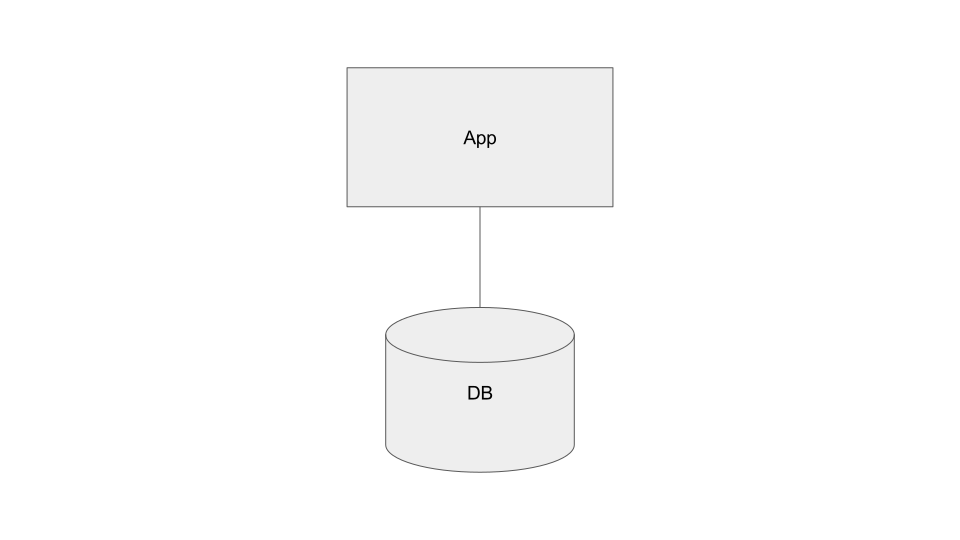
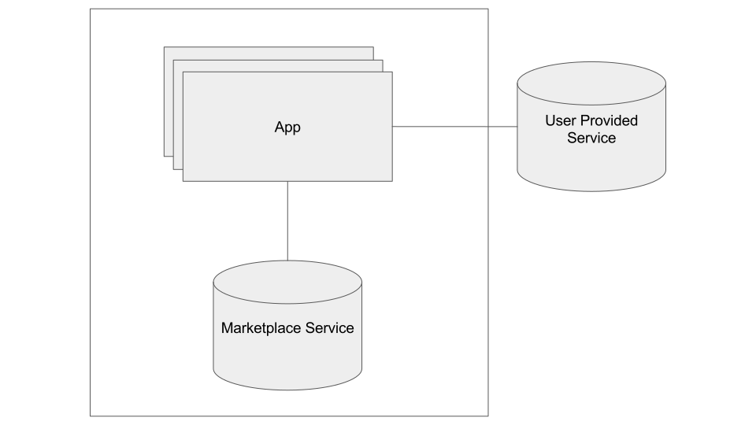

This content is copyright of CloudCredo. © CloudCredo 2015. All rights reserved.

----

## As a Cloud Native I can push an application that has persistent state.

----

----

Bounded Contexts

Note: 

Multiple models are in play on any large project. Yet when code based on
distinct models is combined, software becomes buggy, unreliable, and difficult
to understand.

Explicitly define the context within which a model applies. Explicitly set
boundaries in terms of team organization, usage within specific parts of the
application, and physical manifestations such as code bases and database
schemas. Keep the model strictly consistent within these bounds, but don’t be
distracted or confused by issues outside.

----

Decomposing Data by Boundaries

Note:

Identify each model in play on the project and define its bounded context.
This includes the implicit models of non-object-oriented subsystems. Name each
bounded context, and make the names part of the ubiquitous language. Describe
the points of contact between the models, outlining explicit translation for
any communication and highlighting any sharing. Map the existing terrain.

----

Cloud Foundry Service Commands

----

cf marketplace

Note:
Many distributions of Cloud Foundry have many different services PWS vs IBM
watson etc

----

cf [create, update, delete, rename]-service

Note:
`cf create-service` example

----

cf [bind, unbind]-service

Note:
`cf bind` example

----

cf restage

----

cf create-user-provided-service

Note:
This is over an above the content of the talk but is useful content

If a distribution of Cloud Foundry does not support the service that you need.
You have to options.

Cloud Foundry Native service. You can write a service broker implementation
from scratch. Expensive User provided service. Flexible as it can expose Non
Cloud Foundry services to Cloud Foundry applications. Internal service for
example.

----

----

Questions?

----

Over to you...

----

This content is copyright of CloudCredo. © CloudCredo 2015. All rights reserved.

----
