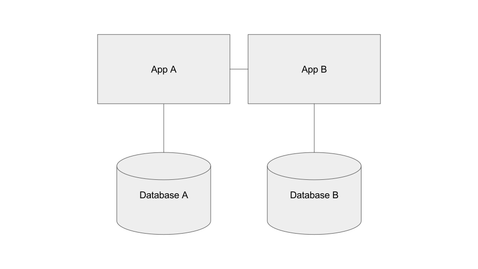

This content is copyright of CloudCredo. © CloudCredo 2015. All rights reserved.

----

## As a Cloud Native I can push a new microservice to add a new feature to my application

----

----

What are monoliths?

Note: 
Going to be talking a lot about microservices today

Before we do that let's talk about the other thing

Monoliths are single apps which do lots of things

Typically not 12 Factor Apps

Getting negative press recently

When a project is small, they're very easy to work with - just one thing 

----

What are microservices?

Note:
Getting a lot of hype

Tiny 12 Factor apps which collaborate to address your business requirements

*Small* services which do one thing, and do it well

Communicate using *standard protocols* (HTTP, message queues, ...)

Natural fit for the cloud

People seem to think they're the solution to all our problems

That they're a new thing

That perfectly good monolithic apps are suddenly evil

Let's ignore the hype

We've been implementing apps built from communicating services for years

Interesting properties fall out of the fact that these things are SMALL.

----

Advantages

Note:
*Easy to understand*:
Large monolithic applications are hard to work on

Cognitive load

Hard for non-experts to be productive in the codebase

Refactoring cross-cutting concerns is hard.

Individual microservices are small

Focus on doing one thing well

Easy for developers to understand a single service in its entirety.

*Scaling*:
Microservices are easy to scale

We'll talk more about scaling later on in the workshop

*Disposable*:
Monoliths are hard to get rid of

Huge investment of time and effort

Microservices are disposable

Small amount of code, small effort, small investment

Don't get emotionally attached.

If it's no longer fit for purpose, bin it with a smile

Easy to spike new microservices

*Polyglot programming*:
Hard to use multiple languages in a monolith

Everything compiled together

But you can write each microservice in its own language

----

Disadvantages

Note:
Communicating across distributed processes is hard

Things can fail in interesting new ways.

What happens if the thing you're trying to talk to suddenly disappears?

Deployment of a monolith is easy to think about

How do you manage tens or even hundreds of microservices
 
All talking to each other

How can we make sense out of all the service interaction noise? (leads on to distributed tracing in the next session)

----

Automate, automate, automate

Note:
Automate!

Manual approaches are doomed to fail.

Invest the time in automated testing, CI, CD, DevOps.

All the way through to production.

CI pipeline is going to be triggered many, many times.

Running on a platform really comes into its own

With automation and a platform, things are more manageable

----

Beware Conway's Law

> organisations which design systems ... are constrained to produce designs which are copies of the communication structures of
these organisations

> Melvin Conway

Note:
Who's heard of Conway's law?

What do you think it means?

Often used as a joke - a way to blame poor architecture on organisational structure

As developers we're used to technical hurdles

Might be your organisation that becomes a barrier to microservices

Be wary of allowing your existing team or business boundaries dictate your architecture

----

Conway's Law Examples

* Dev vs Ops
* Dev vs DBAs
* Dev vs Business
* Dev team A vs Dev team B
* Dev vs regulatory requirements

Note:
Think of a big organisation - the 'Enterprise'

Teams like multiple dev, ops, database admin, networks, security, legal compliance

Dev says they want to start shipping code automatically to prod tens of times a day

Imagine the chaos

Compliance says no way, we'll be sued!

Other dev teams say no way, because reasons!

DBAs say no automated database migrations allowed!

Conway's Law tells us organisational barriers leak into our architecture

End result is an architecture full of half solutions and workarounds

Tempting to jump into microservices thinking only hurdles will be technical

Work together to find mutually acceptable solutions

----

Smash barriers before smashing monoliths!

Note:
If your organisation is not ready for microservices, microservices will make things *worse*

----

Decomposition

Note:
So now that we've smashed all our barriers...

Microservices are sounding pretty good now

But say we have a monolithic application already

How do we move from one to the other?

----

Break out business features into microservices

Note:
Choose a feature and break it out

Start by defining the API to your new service

Common to take a RESTful approach for synchronous

JSON over HTTP

Pervasive tech, well understood, well supported

Rich documents rather than many methods

Many method calls between services couples them

Makes it difficult to evolve them independently

----

Add an API gateway

Note:
If your application is client facing

Single point of entry into your microservice landscape

Talking to multiple services on backend is madness

Internal APIs are likely to be different

You want freedom to change the backend

Use a gateway to break the coupling between front and back

----

Add new business features as new microservices

Note:
New distinct features can be added as new microservices

Don't turn microservices into monoliths

----

Questions?

----

Over to you...

Note:
We're going to push a new version of our feedback application to Cloud Foundry

New feature - you can now ask us questions in real time!

New feature is a new microservice

No API gateway to keep things simple

----

This content is copyright of CloudCredo. © CloudCredo 2015. All rights reserved.

