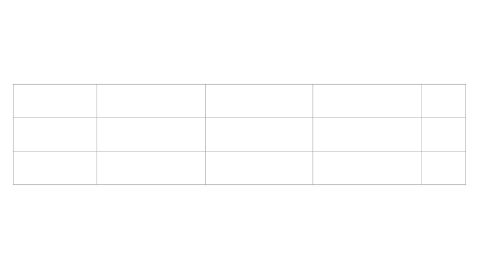

This content is copyright of CloudCredo. © CloudCredo 2015. All rights reserved.

----

## As a Cloud Native I can trace requests across Microservices

----

"Microservices are not a free lunch" 

*A sensible person (2015)*

Note:
1. Operational Overhead
2. State
3. We are about to talk about more...

----

Problems...

----

Issue Discovery

Note: 

1. When something goes bang

----

Tracing

Note:

1. How to trace that bang across other bounded contexts

----

Debugging

Note:

1. How do you debug that bang across bounded contexts

----

Isolated Application Logs

----

Logging Solutions...

----

cf logs

----

First class Cloud Foundry log draining support 

Note: 

In Cloud Foundry the platform helps solve the problem of aggregating
applications logs by providing first class support for a remote sys log sink.  

When a syslog endpoint is registered with your application Cloud Foundry will
pick up stdout and stderr streams and forward them to the configured syslog
endpoint. Giving you a central system to search all of your logs.

----

Log Ingestion

----

Papertrail, Splunk, Loggly, ELK, etc

----

Thousands of Microservice + asynchronous calls = Super massive mess of logs

----

Tracing Solutions...

----

<!--Example problem

Show the application, show the request to the feedback/question services
in the logs and look confused as vcap_request_id is different.

------>

Google Dapper

Note:

1. Google do not log all requests. 
2. They sample them 
3. Ok as meaningful patterns will emerge

----

Spans

Note:

1. Basic unit of work. A call to an API gateway.
2. Spans are identified by a unique  ID for the span 
3. Spans have other data, such as descriptions annotations
4. Spans are started and stopped, 
5. They keep track of their timing information. 

----

Trace

Note:

https://github.com/openzipkin/brave

Trace: 

1. A set of spans forming a tree-like structure. 
2. A Trace per service in the transaction
3. Traces also have ids and other data such as annotations
3. Make up the content of the Span
4. Keep track of the time.
5. Help track bottle necks

----

----

-OUT 2015-10-01 13:50:45.894 [trace=6df93e38-c09f-4aee-9a0e-41b522d008d4,span=8ccbe38b-e3f8-4ca9-97b3-37761c28163f]

----

Zipkin

https://github.com/openzipkin

Note: 

Sequence diagram umly thing - Maybe show a crazy diagram or an example

----

First class Cloud Foundry support for request correlation

----

Sort Of.

https://www.pivotaltracker.com/n/projects/1358110/stories/102051802

https://github.com/cloudfoundry/cf-release/pull/773

Note: 

1. Since v217 
2. The Cloud Foundry router has custom header decoration 
3. Not by default
4. This can be turned on in a private CF deployment 

----

Solution must be architected.

*No free lunch*

Note:
Show the [spring-cloud-sleuth sample](https://github.com/spring-cloud/spring-cloud-sleuth)

----

Decoration

Note:

1. Headers are decorated
2. Consumed and decorated again

----

Questions?

----

Over to you

----

This content is copyright of CloudCredo. © CloudCredo 2015. All rights reserved.

