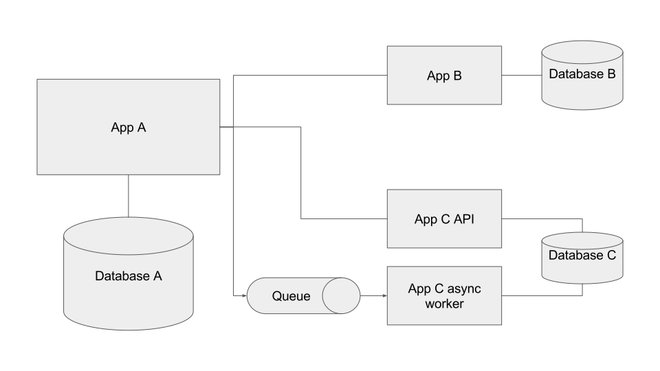

This content is copyright of CloudCredo. © CloudCredo 2015. All rights reserved.

----

## As a Cloud Native I can push an application that communicates asynchronously

----

Note:
Examples so far have been synchronous

What does that mean?

HTTP is a synchronous protocol

When we make a request, we wait until we get a response

Something like a phone call

But sometimes we want email

Fire and forget - sometimes we don't want to wait

This is asynchronous

Works because we know messages will be picked up *eventually*

----

## Message Brokers

Note:
When we post a message, where does it go?

Hand it off to a dedicated messaging system.

These systems are *message brokers*

Responsible for handling and storing messages before they are consumed

Message brokers expose *channels*

Endpoints we can send messages to and receive messages from

There are really two main types of channel

----

## Queues
(point-to-point)

Note:
Queues are really simple to think

Work just like they do in real life

New messages arrive at the back of the queue

Messages are consumed from the front of the queue

Messages are always consumed in the order in which they arrived

What happens if we have multiple consumers from a single queue?

Each subscriber always picks up the message at the front of the queue

Great for load balancing across multiple consumers

Think 12 Factor stateless processes

If any consumer can process any message...

Same queue, instant load balancer

----

## Topics
(publish-subscribe - 'pub-sub')

Note:
Topics are a bit more sophisticated than queues

Consumers create a 'subscription' to the topic

With a single subscriber, topics behave just like queues 

What happens when we have multiple subscribers to a single topic?

*Every* message received by *all* consumers

Topics great for *broadcasting* messages

If all subscribers *need to know* about a message, then topics are ideal.

----

## Call me maybe...?

Note:
Sometimes we really don't care if we never get a reply back to our messages

But sometimes we expect something in return... eventually

How do we get a response back if we're just firing and forgetting?

Simple - listen on a reply channel

Sometimes reply channel known ahead of time

Or can specify reply channel as part of request message

----

## Resilience

Note:
Why is async messaging useful in a microservice architecture?

Resilience
 
Things fail

By introducing a queue or topic we introduce a storage buffer between services

Safe holding place for messages if the consumer dies

Consumer can die, come back again, resume from where it left off

----

## Shock Absorption

Note:
Microservice architectures often need to deal with unpredictable load

What happens if we get a traffic spike?

Synchronous system has to be able to process that spike as it happens

Unrealistic expectation in complex systems

Async creates buffers to temporarily hold the spike

Allows consumers to work as fast as they can without being overwhelmed

----

Questions?

----

Over to you...

Note:
Going to push a new version of our app

New feature - chart of requests hitting our microservices

Added feature as a new microservice

Collects request data asynchronously from a queue in Redis

Very simple example, but good use of a queue

Don't want our main app to be slowed down by having to wait for metadata processing

Decoupled the two concerns using Redis as a very quick message broker

----

This content is copyright of CloudCredo. © CloudCredo 2015. All rights reserved.
