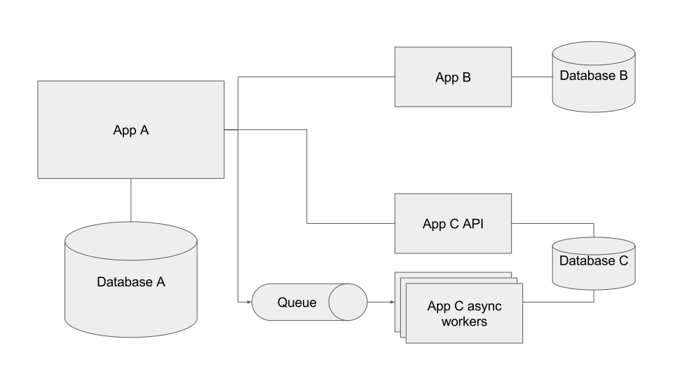

This content is copyright of CloudCredo. © CloudCredo 2015. All rights reserved.

----

## As a Cloud Native I can scale my applications to handle higher load

----

Note:
Scaling is about increasing the performance of your app to meet demand

We're going to look at two ways this can be done

----

Vertical Scaling

('scaling up')

Note:
Means giving existing processes more resources

Might be able to increase performance by allocating more RAM

If running on a server, might need to increase process memory limits

Might be able to use multithreading to utilise more cores

Or buy a bigger server, more cores, more RAM

In the cloud, this can be done by migrating to a bigger or faster virtual machine

*Downsides*:
Server cost
Necessary downtime - app must be restarted

----

Horizontal Scaling

('scaling out')

Note:
Creating more app instances to share the load

Load balancing

No downtime

Very simple to horizontally scale up or down according to demand

Think back to 12 Factor principles

Only works well when apps are stateless and disposable

Any instance must be able to serve any request

Instances can come and go

Design for this, then scaling becomes super easy

----

Scaling Monoliths

(is hard)

Note:
Think about how you might scale a monolithic app

App does a whole heap of things

Maybe serves some web content, interacts with databases, performs some computation...

Only choice is to scale the entire app

Including bits which don't need to be scaled

Inefficient

----

Scaling Microservices

(is easy)

Note:
Small simple services

Scale only the ones you need to

If your web service becomes a bottleneck... scale just that

----

Scaling on Cloud Foundry

Note:
Cloud Foundry supports both vertical and horizontal scaling

Runners - virtual machines to run your apps

When apps are deployed, you can tell Cloud Foundry how much disk and memory they require

Determines how big a slice of the runners your app gets

You can also tell Cloud Foundry how many instances of each app to create

----

CF Vertical Scaling

`cf scale <your app> -k <required disk>[M|G] -m <required memory>[M|G]`

Note:
To vertically scale your app, increase the memory or disk limits

Specify on push or in manifest

----

CF Horizontal Scaling

`cf scale <your app> -i <number of instances>`

Note:
To horizontally scale your app, increase the number of app instances

Cloud Foundry will balance requests across all instances of your app

Specify on push or in manifest

----

Questions?

----

Over to you...

----

This content is copyright of CloudCredo. © CloudCredo 2015. All rights reserved.
