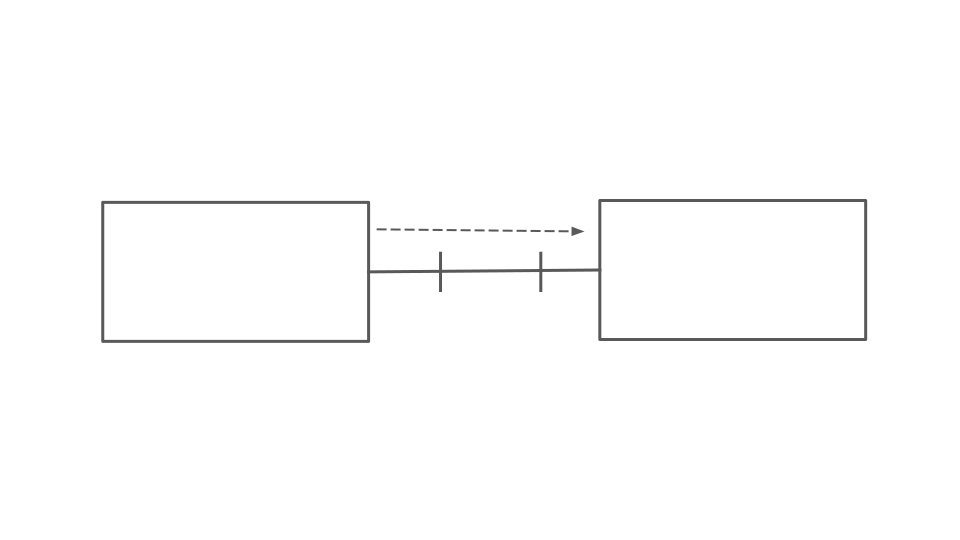
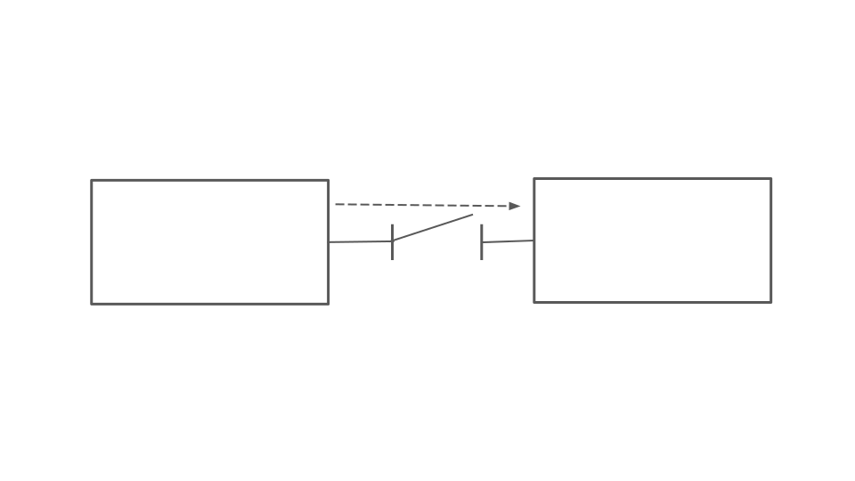

This content is copyright of CloudCredo. © CloudCredo 2015. All rights reserved.

----

## As a Cloud Native I can implement a Circuit breaker

----

Distributed Failures

*Not a free lunch*

Note: 
1. Remote calls fail
2. Services can become unresponsive
3. Could cause cascading failures

----

Build for Failure

----

Netflix

Note:
1. Posterboy

----

----

Problems?

----

Load Balancing

----

Cloud Foundry for free

----

Service Discovery

----

Configuration Server

----

Eureka, Zookeeper, Consul, etcd

----

Environment Variable Groups

Note:
1. Simplest possible thing
2. Restarts required

----

Circuit Breaker...

----

----

Note:
0. Monitor for responsiveness
1. Timeout
2. Open 
3. Success

----

Now What?

----

What to do with requests

----

Persistent queues 

1. Messaging broker take care of things
2. RabbitMQ, ActiveMQ, 

----

Request collapsing

----

Request caching 

----

Hystrix

https://github.com/Netflix/Hystrix

----

Questions?

----

Over to you...

----

This content is copyright of CloudCredo. © CloudCredo 2015. All rights reserved.
